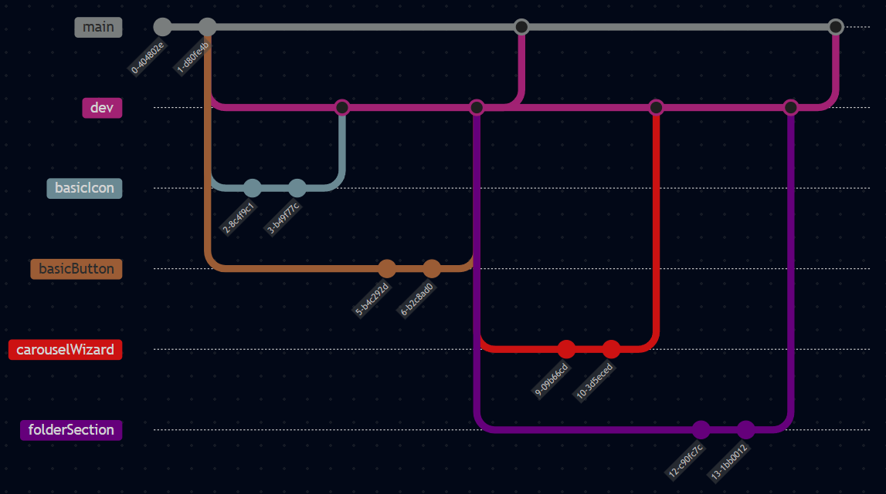

## Git og Versonsstyring
I projektet har vi brugt Git som versionsstyring. Det har gjort det muligt at holde styr på ændringer i koden og samtidig samarbejde effektivt i gruppen. Git har især været nyttigt, fordi det gemmer hele historikken over projektets udvikling og gør det nemt at gå frem og tilbage mellem tidligere versioner af koden.

**Fordele ved versionsstyring i projektet:**

- Nem adgang til tidligere versioner af koden
- Effektivt samarbejde i grupper
- Automatisk logning af ændringer og historik

## Branching strategi
Vi har brugt en forsimplet version af **gitflow** som branching strategi. Alt arbejde foregår på separate feature branches. 

**Main** er den primære branch der kun indeholder testet og produktionsklar kode. Der er opsat regler, der forhindrer direkte push til main, og ændringer kan kun tilføjes med pull requests.

**Dev** fungerer som udviklingsbranch, hvor ny funktionalitet samles inden det integreres i main. Feature branches oprettes fra dev og merges tilbage, når arbejdet er færdigt og testet. Når en feature branch er færdig og merged til “dev”, slettes branchen typisk for at holde repositoriet rent.



## Github Actions & workflows (CI/CD)
Github actions er anvendt til at automatisere deployment og statisk kodeanlyse flows.

| Workflow                         | Branch       | Trigger      | Formål                                                                 |
|:---------------------------------|:-------------|:-------------|:------------------------------------------------------------------------|
| Kør ESLint                       | Main & dev   | Pull request | Sikrer at koden følger ESLint-regler før merge                         |
| Deploy side med Firebase Hosting | Main         | Push         | Gør ny version af applikationen tilgængelig live                       |

Ved at bruge den branching strategi vi bruger sammen med disse flows, understøtter vi CI/CD. 

**Continous Integration** - koden automatisk testes ved hjælp af eslint workflow på pull requests.

**Continous Delivery** - Vi manuelt vælger hvornår koden skal udgives ved at push dev ind i main og kun på main deploys siden.


### YAML-fil til ESLINT-workflow
```
name: Run eslint on pull requests

on:
pull_request:
branches:
- dev
- main

jobs:
lint:
name: Run ESLint
runs-on: ubuntu-latest

    steps:
      - name: Pull code to virtual machine
        uses: actions/checkout@v4

      - name: Install Node.js
        uses: actions/setup-node@v3
        with:
          node-version: 20

      - name: Install dependencies
        run: npm ci

      - name: Run ESLint
        run: npm run lint
```


### Navigation
- [Start side](index.md)
- [Clean Code](cleanCode.md)
- [Test](test.md)